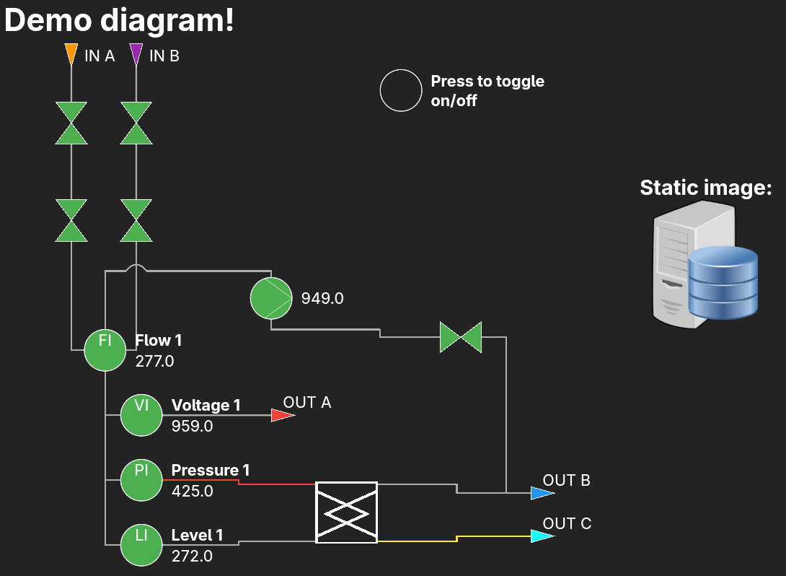

<div align="center">
    
</div>

<div align="center">
    <i>A Flutter package for making modular, reactive, interactive schematic diagrams easily.</i>
</div>

<br />

<div align="center">
    <a href="https://pub.dev/packages/schematic_diagrams">
      
    </a>    
    <a href="https://github.com/alettsy/schematic_diagrams/issues">
      
    </a>    
    <a href="https://github.com/alettsy/schematic_diagrams/">
      
    </a>
</div>

<div align="center">
    <a href="https://ko-fi.com/W7C027ZZTS">
        
    </a>
</div>

<hr />



Quick links:

- [Features](#features)
- [Quick start](#quick-start)
- [Screenshots](#screenshots)
- [Roadmap](#roadmap)
- [Contributing](#contributing)
- [Limitations](#limitations)

## Features

You should be able to:

- Create a themed diagram
- Use built-in nodes and linking strategies
- Create your own nodes by extending the base classes and mixins
- Create interactions, updates, links, and text blocks on your nodes
- Theme your nodes and links

## Quick start

This sections covers:

- [Making a diagram](#making-a-diagram)
- [Themes](#themes)
- [Using nodes and links](#using-nodes-and-links)
- [Creating your own nodes](#creating-your-own-nodes)
- [Added functionality with mixins](#added-functionality-with-mixins)
- [Mutability and reactivity](#mutability-and-reactivity)

For a working example, check: [example](example/lib/main.dart)

### Making a diagram

There are two imports you need to be aware of:

1. The main import, which includes the diagram, node model, link model, themes, mixins, interfaces, etc
   1. `import 'package:schematic_diagrams/schematic_diagrams.dart'`
2. And the premade nodes import, which includes premade nodes, such as the P&ID nodes
   1. `import 'package:schematic_diagrams/premade.dart'`

A diagram consists of the **widget** and the **model**. To create an empty diagram, you can do:

```Dart
import 'package:schematic_diagrams/schematic_diagrams.dart';

return SchematicDiagram(
  model: SchematicDiagramModel(nodes: [].protected)
);
```

> [!NOTE]
> Nodes, Links, Ports, and TextBlocks are _protected_, which means they require unique IDs to work properly.
> Because of this, the `ProtectedList<T>` has been provided to make this behaviour consistent.
>
> When making ports and text blocks, you can instantiate it like `ProtectedList<T>([...])`, or
> you can call `[...].protected` on a normal list.

### Themes

To theme your diagram, you can override the `schematicTheme` property of the model:

```Dart
import 'package:schematic_diagrams/schematic_diagrams.dart';

return SchematicDiagram(
  model: SchematicDiagramModel(
    nodes: [].protected,
    links: [].protected,
    schematicTheme: const SchematicTheme(
      backgroundColor: Colors.purple,
      borderColor: Colors.orange,
      borderRadius: BorderRadius.circular(10),
      borderWidth: 10
    )
  )
);
```

To set the default `node`, `link`, and `textBlock` themes, you can override their respective properties in the model:

- `defaultNodeTheme`
- `defaultLinkTheme`
- `defaultTextBlockTheme`

```Dart
import 'package:schematic_diagrams/schematic_diagrams.dart';

return SchematicDiagram(
  model: SchematicDiagramModel(
    nodes: [].protected,
    links: [].protected,
    defaultNodeTheme: const NodeTheme(fill: Colors.orange),
    defaultLinkTheme: const LinkTheme(strokeWidth: 2),
    defaultTextBlockTheme: const TextBlockTheme(fontSize: 24, color: Colors.purple),
    schematicTheme: const SchematicTheme(
      backgroundColor: Colors.purple,
      borderColor: Colors.orange,
      borderRadius: BorderRadius.circular(10),
      borderWidth: 10
    )
  )
);
```

When it comes to themes, there are three layers:

1. Default/override
2. Transient
3. Parts

The default will be used whenever there is no active transient or part theme. Transient theme is a full theme override at the widget-level; you can update this at any time to alter the look of your node by called `setTheme(theme)`, and revert back to the default by calling `resetTheme()`.

Part themes are a little more complicated. These are renderer-based, and are only supported in some premade nodes (but you can add them to your custom renderers as well). They are essentially transient themes that target specific, individual parts of a design. So `setPartThemeOverride(1, theme)` will be used by the renderer wherever `getPartThemeOverride(1)` is called. You can see this being used by the premade `GateValve` node.

### Using nodes and links

Nodes and links both get passed into the **model**.

For example, to add a `GateValve` node to the diagram:

```Dart
import 'package:schematic_diagrams/schematic_diagrams.dart';
import 'package:schematic_diagrams/premade.dart';

return SchematicDiagram(
  model: SchematicDiagramModel(
    nodes: [
      GateValve(id: 'g1', position: Position(50, 75), title: 'Gate 1'),
    ].protected,
  )
);
```

To link two nodes together, they need to both be `Linkable` and have at least one `Port`. The built-in nodes have appropriately placed default ports.

The `GateValve` has ports at the `top`, `right`, `bottom`, and `left` of it and they are named as such.

For example:

```Dart
import 'package:schematic_diagrams/schematic_diagrams.dart';
import 'package:schematic_diagrams/premade.dart';

return SchematicDiagram(
  model: SchematicDiagramModel(
    nodes: [
      GateValve(id: 'g1', position: Position(50, 75), title: 'Gate 1'),
      GateValve(id: 'g2', position: Position(50, 200), title: 'Gate 2'),
    ].protected,
    links: [
      Link(
        id: 'connect-g1-to-g2',
        fromNodeId: 'g1',
        toNodeId: 'g2',
        fromPortId: 'bottom',
        toPortId: 'top',
        inFrom: LinkDirection.top,
        outTo: LinkDirection.bottom,
      ),
    ].protected
  )
);
```

When linking, you must provide the directions for the link to enter and exit the to/from ports. You can enter whichever you like, but in this case bottom to top makes the most visual sense.

If a link is provided where one or more nodes or ports cannot be found, it will be _ignored_.

> [!NOTE]  
> Links can be drawn out to/in from any direction, by specifying the `outTo` and `inFrom` properties.
>
> The example link above means: draw the link downwards from the `from` port, and at the end, draw it in from above the `to` port.
>
> If you are confused with the `inFrom` and `outTo` properties, think of it like so: "draw from port A _outTo_ the bottom of it, and draw into port B _inFrom_ the top of it"

### Creating your own nodes

You can see how the built-in nodes are made in [lib/src/premade](lib/src/premade).

To make your own basic node, you can override the `Node` class:

```Dart
import 'package:schematic_diagrams/schematic_diagrams.dart';

class CustomNode extends Node {
  CustomNode({required super.id, required super.renderer});
}
```

There are some built-in renderers you can use in [lib/src/rendering/standard](lib/src/rendering/standard):

- `DesignlessRenderer` - invisible design
- `ImageRenderer` - loads a static image
- `PaintedNodeRenderer` - override to create a custom painted node
- `SvgDataRenderer` - accepts SVG path data

You can also use the ones in [lib/src/premade/pid/renderers](lib/src/premade/pid/renderers).

For example, to make a simple, custom painted triangle renderer:

```Dart
import 'package:schematic_diagrams/schematic_diagrams.dart';

class CustomNode extends Node {
  CustomNode({required super.id}) : super(renderer: CustomRenderer());
}

class CustomRenderer extends PaintedNodeRenderer {
  @override
  void paint(
    Canvas canvas,
    Node node,
    NodeTheme defaultNodeTheme,
    TextBlockTheme defaultTextBlockTheme,
  ) {
    final fillPaint = getFill(node, defaultNodeTheme);
    final outlinePaint = getStroke(node, defaultNodeTheme);

    final path = Path()
      ..moveTo(node.size.width / 2, 0)
      ..lineTo(0, node.size.height)
      ..lineTo(node.size.width, node.size.height)
      ..close();

    canvas
      ..drawPath(path, fillPaint)
      ..drawPath(path, outlinePaint);
  }
}
```

### Added functionality with mixins

You can extend your nodes with [mixins](lib/src/core/mixins) to add extra functionality:

- `Linkable` - allows the node to have ports that can be linked with other nodes
- `Tappable` - allows the node to react to taps
- `TextBlockable` - add text blocks to the node
- `Updatable` - allows the node to refresh/update
- `Valuable` - allow the node to maintain a value (calls `update()` on change)

To make our `CustomNode` from before `Linkable` and `Valuable`, you can do the following:

```Dart
import 'package:schematic_diagrams/schematic_diagrams.dart';

class CustomNode extends Node with ChangeNotifier, Updatable, Linkable, Valuable<double> {
  CustomNode({required super.id}) : super(renderer: CustomRenderer()) {
    ports = [
      Port(id: 'port1', position: Position(0, 0))
    ].protected;
  }

  @override
  void update() {
    // What to do when the value changes
  }
}
```

### Mutability and reactivity

A node that is `Updatable` should also have a `ChangeNotifier`. The `update()` function provided by the former should call `notifyListeners()`.

The `update()` function can include whatever you want to do to the node before it is refreshed (e.g. by calling `notifyListeners()`), such as by changing the theme, text blocks, ports, etc.

By default, a `Valuable` node will call `.update()` internally when the value changes.

You can extend this logic as much as you want so you can call `.update()` from wherever you need the node to refresh, under whatever condition.

An example to update the individual parts of the gate valve based on the value would look like:

```Dart
@override
void update() {
  // if the value is null, it hasn't been set yet, so skip
  if (value == null) return;

  if (value! > 0) {
    // set top of gate valve to orange and bottom  of gate valve to purple
    setPartThemeOverride(0, const NodeTheme(fill: Colors.orange));
    setPartThemeOverride(1, const NodeTheme(fill: Colors.purple));
  } else {
    // clear all colors (goes back to default node theme)
    setPartThemeOverride(0, null);
    setPartThemeOverride(1, null);
  }

  // notify the node has changed
  notifyListeners();
}
```

Here is another example

```Dart
@override
void update() {
  // if the value is null, it hasn't been set yet, so skip
  if (value == null) return;

  if (value! > 0) {
    // update the whole theme of the node at once
    setTheme(const NodeTheme(
      fill: Colors.brown,
      strokeWidth: 3,
    ));

    // update title text to "Active"
    setTextById('title', 'Active');
  } else {
    // reset the theme to default
    resetTheme();

    // update title text to "Inactive"
    setTextById('title', 'Inactive');
  }

  // notify the node has changed
  notifyListeners();
}
```

## Screenshots


You can see more examples in the [example](example/lib/main.dart) project.

## Roadmap

Features and changes I hope to work on soon:

- More built-in P&ID nodes
- Reactive links
- Helpful functions on nodes, links, and the diagram
- Exporting and importing (JSON)
- More test coverage
- Any other suggestions that come through!

## Contributing

All contributions are welcome!

See [CONTRIBUTING](CONTRIBUTING.md) for how.

## Limitations

Check the [roadmap](#roadmap) for planned features.

Some current limitations:

- Links are not updatable
- Small set of premade P&ID nodes
- Only the standard straight-line link router
- No importing/exporting built-in
