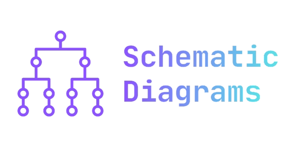

_A Flutter package for making modular, reactive schematic diagrams easily._

<hr />

Quick links:

- [Features](#features)
- [Quick start](#quick-start)
- [Screenshots](#screenshots)
- [Roadmap](#roadmap)
- [Contributing](#contributing)

## Features

The current release version is: **0.0.1**.

You should be able to:

- Create a themed diagram
- Use built-in nodes and linking strategies
- Create your own nodes by extending the base classes and mixins
- Create interactions, updates, links, and text blocks on your nodes
- Theme your nodes and links

## Quick start

This sections covers:

- [Making a diagram](#making-a-diagram)
- [Using nodes and links](#using-nodes-and-links)
- [Creating your own nodes](#creating-your-own-nodes)
- [Added functionality with mixins](#added-functionality-with-mixins)

For a working example, check: [example](example/lib/main.dart)

### Making a diagram

A diagram consists of the **widget** and the **model**. To create an empty diagram, you can do:

```Dart
return SchematidDiagram(
  model: SchematicDiagramModel(nodes: [], links: [])
);
```

To theme your diagram, you can override the `schematicTheme` property of the model:

```Dart
return SchematidDiagram(
  model: SchematicDiagramModel(
    nodes: [],
    links: [],
    schematicTheme: SchematicTheme(
      backgroundColor: Colors.purple,
      borderColor: Colors.orange,
      borderRadius: BorderRadius.circular(10),
      borderWidth: 10
    )
  )
);
```

To override the default `node`, `link`, and `textBlock` themes, you can override their respective properties in the model:

- `defaultNodeTheme`
- `defaultLinkTheme`
- `defaultTextBlockTheme`

### Using nodes and links

Nodes and links both get passed into the **model**.

For example, to add a `GateValve` node to the diagram:

```Dart
return SchematidDiagram(
  model: SchematicDiagramModel(
    nodes: [
      GateValve(id: 'g1', position: Position(50, 75), title: 'Gate 1'),
    ],
    links: []
  )
);
```

To link two nodes together, they need to both be `Linkable` and have at least one `Port`. The built-in nodes have appropriately placed default ports.

The `GateValve` has ports at the top, right, bottom, and left of it and they are named as such.

For example:

```Dart
return SchematidDiagram(
  model: SchematicDiagramModel(
    nodes: [
      GateValve(id: 'g1', position: Position(50, 75), title: 'Gate 1'),
      GateValve(id: 'g2', position: Position(50, 200), title: 'Gate 2'),
    ],
    links: [
      Link(
        id: 'connect-g1-to-g2',
        fromNodeId: 'g1',
        toNodeId: 'g2',
        fromPortId: 'bottom',
        toPortId: 'top',
        inFrom: LinkDirection.top,
        outTo: LinkDirection.bottom,
      ),
    ]
  )
);
```

When linking, you must provide the directions for the link to enter and exit the to/from ports. You can enter whichever you like, but in this case bottom to top makes the most visual sense.

If a link is provided where one or more nodes or ports cannot be found, it will be _ignored_.

### Creating your own nodes

You can see how the built-in nodes are made in [lib/src/premade](lib/src/premade).

To make your own basic node, you can override the `Node` class:

```Dart
class CustomNode extends Node {
  CustomNode({required super.id, required super.renderer});
}
```

There are some built-in renderers you can use in [lib/src/rendering/standard](lib/src/rendering/standard):

- `DesignlessRenderer` - invisible design
- `ImageRenderer` - loads a static image
- `PaintedNodeRenderer` - override to create a custom painted node
- `SvgDataRenderer` - accepts SVG path data

You can also use the ones in [lib/src/premade/pid/renderers](lib/src/premade/pid/renderers).

For example, to make a simple, custom painted triangle renderer:

```Dart
class CustomNode extends Node {
  CustomNode({required super.id}) : super(renderer: CustomRenderer());
}

class CustomRenderer extends PaintedNodeRenderer {
  @override
  void paint(
    Canvas canvas,
    Node node,
    NodeTheme defaultNodeTheme,
    TextBlockTheme defaultTextBlockTheme,
  ) {
    final fillPaint = getFill(node, defaultNodeTheme);
    final outlinePaint = getStroke(node, defaultNodeTheme);

    final path = Path()
      ..moveTo(node.size.width / 2, 0)
      ..lineTo(0, node.size.height)
      ..lineTo(node.size.width, node.size.height)
      ..close();

    canvas
      ..drawPath(path, fillPaint)
      ..drawPath(path, outlinePaint);
  }
}
```

### Added functionality with mixins

You can extend your nodes with [mixins](lib/src/core/mixins) to add extra functionality:

- `Linkable` - allows the node to have ports that can be linked with other nodes
- `Tappable` - allows the node to react to taps
- `TextBlockable` - add text blocks to the node
- `Updatable` - allows the node to refresh/update
- `Valuable` - allow the node to maintain a value (calls `update()` on change)

To make our `CustomNode` from before `Linkable` and `Valuable`, you can do the following:

```Dart
class CustomNode extends Node with Updatable, Linkable, Valuable<double> {
  CustomNode({required super.id}) : super(renderer: CustomRenderer()) {
    ports = [Port(id: 'port1', position: Position(0, 0))].protected;
  }

  @override
  void update() {
    // What to do when the value changes
  }
}
```

## Screenshots


You can see more examples in the [example](example/lib/main.dart) project.

## Roadmap

Features and changes I hope to work on soon:

- More built-in P&ID nodes
- Reactive links
- Helpful functions on nodes, links, and the diagram
- Exporting and importing (JSON)
- More test coverage
- Any other suggestions that come through!

## Contributing

All contributions are welcome!

See [CONTRIBUTING](CONTRIBUTING.md) for how.
